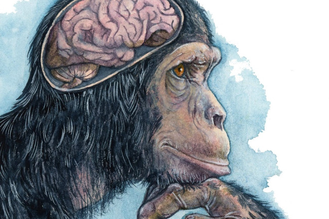

```{r setup, include=FALSE}
knitr::opts_chunk$set(echo = FALSE)
```


# Article 2 : Primate brain size does not predict their intelligence.



picture source : <https://www.discovermagazine.com/planet-earth/everything-worth-knowing-about-animal-intelligence>

## Sources of the article with publication date and word count

<https://www.sciencedaily.com/releases/2020/09/200925113353.htm>

Word count : 637

## Vocabulary

| word from the test              | Synonym/definition in English                                                              | French translation         |
| ------------------------------- | ------------------------------------------------------------------------------------------ | -------------------------- |
| brain                           | the organ inside the head that controls movement, thought, memory and feeling              | cerveau                    |
| cognitive                       | connected with mental processes of understanding                                           | cognitif                   |
| lemurs                          | an animal like a monkey, with thick fur and a long tail, that lives in trees in Madagascar | lémuriens                  |
| great apes                      | one of the large animals that are most similar to humans                                   | les grands singes          |
| the  relationship               | relation , understanding                                                                   | la relation                |
| insight                         | an understanding of what something is like                                                 | idée/bon sens/perspicacité |
| gorillas                        |  a very large powerful African ape covered with black or brown hair                        | gorille                    |
| a ape                           |  a large animal like a monkey, with no tail.                                               | un singe                   |
| orangutans                      | a large ape with long arms and red-brown hair, that lives in Borneo and Sumatra            | orang-outan                |
| relatives                       | a person who is in the same family as somebody else                                        | proches                    |
| to investigate                  | to find out information and facts about a subject or problem by study or research          | examiner / rechercher      |
| enable                          | allow                                                                                      |  permettre                 |
| to differ up to 200-fold        | to be different                                                                            | différer jusqu'à 200 fois  |
| whether                         | if                                                                                         | si                         |
| baboon                          | a large African or Asian monkey with a long face like a dog’s                              | babouin                    |
| knowledge                       | the information, understanding and skills that you gain through education or experience    | connaissance               |
| however                         | but                                                                                        | cependant                  |
| mammals                         | any animal that gives birth to live young, not eggs, and feeds its young on milk.          | mammifère                  |
| which is why                    | /                                                                                          | c'est pourquoi             |
| the ring-tailed lemur           | species of lemur                                                                           | le lémur catta/ Maki       |
| the black-and-white ruffed lemu | species of lemur                                                                           | Le Vari noir et blanc      |
| the grey mouse lemur            | species of lemur                                                                           | Le Chirogale mignon        |
| neither                         | nobody / not anyone                                                                        | aucun des deux             |
| instead                         | in the place of somebody/something                                                         | à la place/ au lieu        |
| to emphasize                    | to make something easier to notice                                                         | souligner/insister         |
|  further                        | extra                                                                                      | supplémentaire             |


## Analysis table about the study

* Researchers? : 
  + A team from the "Behavioral Ecology and Sociobiology Unit" in the German Primate Center (DPZ = Deutsches Primatenzentrum).
  + Claudia Fichtel, one of the two first authors of the study
* Published in ? when? : published in "ScienceDaily" on September 25, 2020
* Procedure/What was examined ? : In first, they used a comprehensive standardized test series of cognitive experiments : "Primate Cognition Test Battery" (PCTB). Small children and great apes (baboons, macaques) have been tested for their cognitive abilities in the physical and social domain.
then they tested three lemur species with the PCTB. 
* conclusion/ discovery : Initial studies have shown that children possess a better social intelligence than non-human primates. In the physical domain, the species hardly differed even though they show great variation in their relative brain sizes. 
the test on the three lemur species show that despite their smaller brains lemurs' average cognitive performance in the tests of the PCTB was not fundamentally different from the performances of the other primate species. the cognitives abillities of apes can not be generalized. 
*Remaining questions : /

