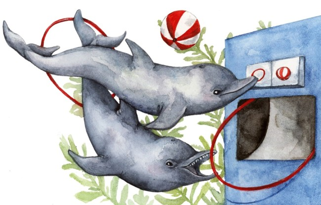

```{r setup, include=FALSE}
knitr::opts_chunk$set(echo = FALSE)
```

# Article 3 : Dolphins learn how to use tools from peers, just like great apes.



picture source : <https://www.discovermagazine.com/planet-earth/everything-worth-knowing-about-animal-intelligence>

## Sources of the article with publication date and word count

<https://www.nationalgeographic.com/animals/2020/06/dolphins-use-tools-peers-similar-great-apes/>

word count : 722

## Vocabulary

| word from the test  | Synonym/definition in English                                                                                                      | French translation       |
| ------------------- | ---------------------------------------------------------------------------------------------------------------------------------- | ------------------------ |
| tools               | an instrument such as a hammer, screwdriver, saw, etc. that you hold in your hand and use for making things, repairing things, etc | matériels/outils         |
| hunting skills      | going after and killing wild animals as a sport or for food                                                                        | compétence de chasse     |
| bottlenose dolphins | /                                                                                                                                  | grands dauphins          |
| peer                | a person who is the same age or who has the same social status as you                                                              | le paire                 |
| to chase            | a process of trying hard to get something                                                                                          | poursuivre/pourchasser   |
| shell               | any structure that forms a hard outer frame                                                                                        | coquille                 |
| giant snail         | /                                                                                                                                  | escargot géant           |
| seafloor            | /                                                                                                                                  | fond marin               |
| to drain            | to make liquid flow away from something; to flow away                                                                              | essorer/déshydrater      |
| offsprins           | the young of an animal or plant                                                                                                    | descendance              |
| beaks               | the hard pointed or curved outer part of a bird’s mouth                                                                            | bec                      |
| foraging            |  to search widely for food                                                                                                         | recherche de nourriture  |
| to set              | to arrange or fix something; to decide on something                                                                                | déterminer               |
| tremendous          | huge                                                                                                                               | immense                  |
| ant                 | a small insect that lives in highly organized groups. There are many types of ant.                                                 | fourmis                  |
| to occur            | to happen                                                                                                                          | arriver/avoir lieu       |
| heatwave            | a period of unusually hot weather                                                                                                  | vague de chaleur         |
| likely              | probably                                                                                                                           | probablement             |
| sightings           | an occasion when somebody sees somebody/something, especially something unusual or something that lasts for only a short time      | vision                   |
| loosely             | separately                                                                                                                         | en vrac/ par ci par là   |
| throughout          | during the whole period of time of something                                                                                       | tout au long de          |

## Analysis table about the study

* Researchers? : 
  + Study author Michael Krützen, an anthropologist at the University of Zurich 
   launched the study of Shark Bay’s dolphins
  + article written by Liz Langley 
* Published in ? when? : published in "National geographic" on June 25, 2020
* Procedure/What was examined ? : Krützen identifies more than a thousand individual dolphins over 11 years. During this time, scientists observed shelling 42 times among 19 dolphins. 
* conclusion/ discovery : shelling is socially transmitted among dolphin peers rather than between mother and offspring sets highlights similarities with certain primates, who also rely on both vertical and horizontal learning of foraging behavior. 
*Remaining questions : /
