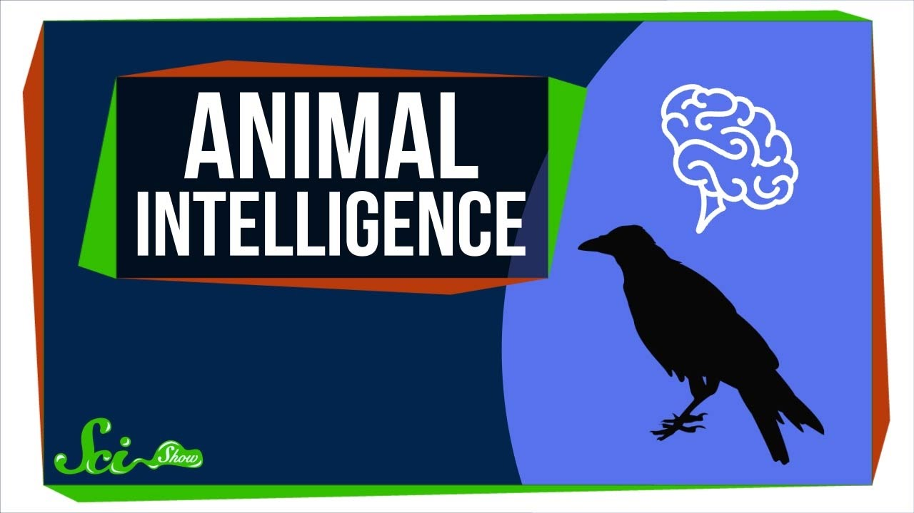

picture source : <https://www.youtube.com/watch?app=desktop&v=6VfYyz8Zpho>

```{r, echo = FALSE, eval = FALSE}
#distill::create_post("my post") # use this fonction to create a new post
distill::create_post("First article")
```


```{r, echo = FALSE, eval = FALSE}
distill::create_post("Second article")
```
```{r, echo = FALSE, eval = FALSE}
distill::create_post("Third article")
```

